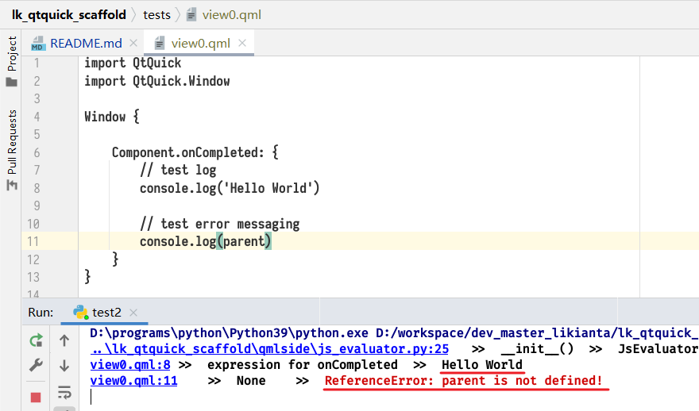
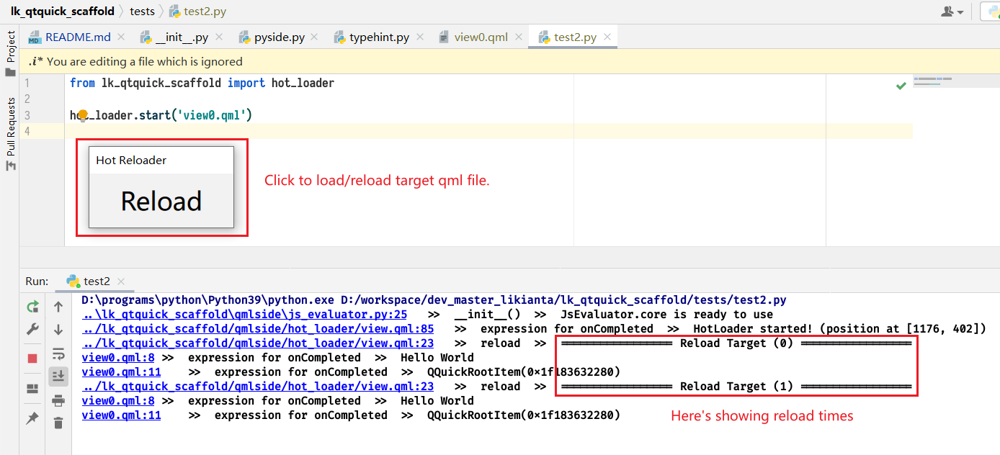
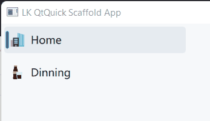

# LK QtQuick Scaffold

Using Python and Qt QML to build desktop applications from a series of
predefined tools.

# Highlights

- A layout engine to extend QML layouts.
- Integrate qt logging with python console (no need to enable "emulate terminal
  in output console" in PyCharm).
- Executing Python snippet in QML, and vice versa.
- Easy-to-use register handler for registering Python functions to QML side.
- Hot loader for testing target layout.
- Assets manager to thoroughly control application appearance (color, motion,
  shape, typograph, and so on).
- A built-in theme to quickly produce elegant user interface. For example,
  use `LCButton` or `LCGhostButton` to replace the normal `Button`.
    - Currently (v1.x) there's only one theme (LightClean Theme) provided.

# Feature Quickview

## Layout Engine

```qml
import QtQuick

Item {
    Rectangle {
        Component.onCompleted: {
            LKLayoutHelper.quick_anchors(this, parent, {
                'reclines': [1, 1, 0, 1], // left, top, right, bottom
                'margins': [12, 4, 12, 4] // left, top, right, bottom
            })
        }
    }
}
```

```qml
import QtQuick

Row {
    spacing: 4
    
    Rectangle {
        width: 0.5 // 50% of parent.width (respect parent.spacing)
        height: parent.height
    }
    
    Rectangle {
        width: 0.2 // 20% of parent.width (respect parent.spacing)
        height: parent.height
    }
    
    Rectangle {
        width: 0 // fill the rest (30% of parent.width) (respect parent.spacing)
        height: parent.height
    }
    
    Component.onCompleted: {
        LKLayoutHelper.hadjust_children_size(this)
    }
}
```

*TODO:MoreExamples*

## Integrate qt logging with python console



## Executing Python snippet in QML, and vice versa

```python
from lk_qtquick_scaffold import eval_js

def foo(a: QObject, b: QObject):
    eval_js('''
        {0}.anchors.left = Qt.binding(() => {{
            return {1}.anchors.left
        }})
    ''', a, b)
```

```qml
import QtQuick

ListView {
    model: pyside.eval(`
        import os
        files = os.listdir(input('target folder: '))
        return files
    `)
}
```

## Register Python functions to QML side

There're two ways to register:

```python
from lk_qtquick_scaffold import reg

@reg()
def foo(*args, **kwargs):
    print(args, kwargs)
    return True
```

```python
from lk_qtquick_scaffold import pyside

def foo(*args, **kwargs):
    print(args, kwargs)
    return True

pyside.register(foo)
```

Then call it by function name in QML side:

```qml
import QtQuick

Item {
    Component.onCompleted: {
        var result = pyside.call('foo', [1, 2, 3], {'aaa': 4, 'bbb': 5})
    }
}
```

## Hot Loader

```python
from lk_qtquick_scaffold import app, hot_loader

# Just replace `app.start` with `hot_loader.start`
# app.start('view.qml')
hot_loader.start('view.qml')
```



## Assets Manager

*TODO:AssetsManagerExample*

## LightClean Theme

See
also [code_examples/eg01_viscous_indicator_anim](code_examples/animations/eg01_viscous_indicator_anim/view.qml):

```qml
import QtQuick
import LightClean
import LightClean.LCComplex

LCWindow {
    width: 280
    height: 360

    LCSideBar {
        anchors.fill: parent

        // icon from: https://iconduck.com/sets/bubblecons-nations-icon-set
        p_model: [
            {m_title: 'Sprint', m_icon: 'file:stopwatch.svg'},
            {m_title: 'Boomerang', m_icon: 'file:boomerang.svg'},
            {m_title: 'Football', m_icon: 'file:football-spain.svg'},
        ]
    }
}
```

In this example, `LCSideBar` uses a simple model struct to generate items. Each
item has apperance in different status (hovered, selected, etc.), an indicator
moves when selection changed.



**More screenshots**

*TODO:AddMoreWidgetsDemo*

# Working in Progress

- The documentation is far away to ready status.
- LightClean Theme is found in Sept. 2020, but it is under refactoring in recent
  months.
    - The documentation is not provided. You have to check its source code for
      more infomation.
    - Some old widgets have bugs unfixed.
- The registered functions by `@reg()` or `pyside.register()` are not Slot
  functions. So it may cause GUI latency on doing heavy task. (It will be
  resolved in future releases.)
