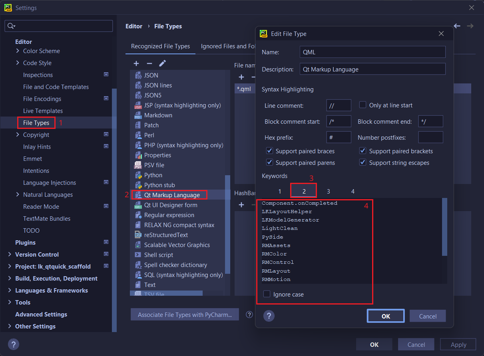

为了提升在 pycharm 中编码的体验. 您可以在 `设置 - Editor - File Types` 中添加 QML 关键词.

原文请参考这个项目: [pycharm-qml-keywords-highlight](https://github.com/Likianta/pycharm-qml-keywords-highlight).

本文在原文基础上, 推荐添加以下特定的关键词, 以优化本项目注入到 QML 上下文的对象的代码自动补全体验.

*请将下面的内容粘贴到关键词面板的任意一栏中, 如下图所示.* 



```
LightClean
LightClean.LCBackground
LightClean.LCButtons
LightClean.LCComplex
LightClean.LCStyle
LKLayoutHelper
LKLayoutHelper.calc_model_size
LKLayoutHelper.fill_height
LKLayoutHelper.fill_width
LKLayoutHelper.hadjust_children_size
LKLayoutHelper.halign_center
LKLayoutHelper.halign_children
LKLayoutHelper.quick_align
LKLayoutHelper.quick_anchors
LKLayoutHelper.vadjust_children_size
LKLayoutHelper.valign_children
LKLayoutHelper.valign_center
LKLayoutHelper.weak_anchors
LKModelGenerator
LKModelGenerator.create
PySide
PySide.call
PySide.eval
RMAssets
RMAssets.get
RMColor
RMColor.get
RMControl
RMControl.get
RMLayout
RMLayout.get
RMMotion
RMMotion.get
RMShape
RMShape.get
RMText
RMText.get
pyside
pyside.call
pyside.eval
```

Other (not necessary):

```
Component.onCompleted
anchors.centerIn: parent
anchors.fill: parent
anchors.horizontalCenter: parent.horizontalCenter
anchors.verticalCenter: parent.verticalCenter
console
console.log
```
